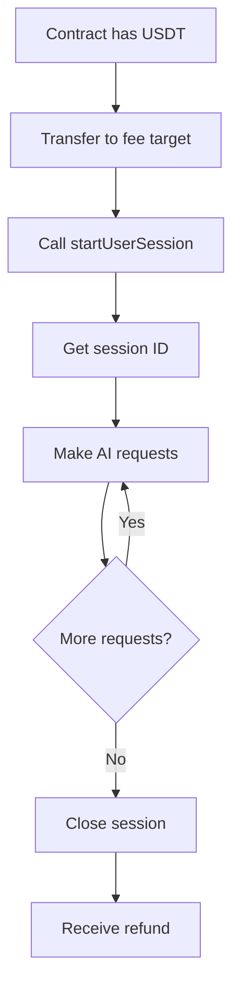

# AI Sessions

AI Sessions are a fundamental concept in the Deep Trust Network that manages payment and lifecycle for AI requests. Sessions work with USDT tokens and provide a way to handle multiple AI requests efficiently.

## What are AI Sessions?

An AI Session is a payment mechanism that allows you to:

- Pre-fund multiple AI requests
- Manage costs across multiple interactions
- Get refunds for unused funds
- Track usage and spending

## How Sessions Work

### 1. Session Creation

To start a session, you need to:

1. **Send USDT tokens** to the AI fee target address
2. **Call `ai.startUserSession()`** to create the session

```solidity
function startSession() public {
    // Get the fee token (USDT) address
    address feeToken = ai.feeToken();
    
    // Get the fee target address
    address feeTarget = ai.feeTarget();
    
    // Transfer tokens to the fee target
    uint256 amount = IERC20(feeToken).balanceOf(address(this));
    IERC20(feeToken).safeTransfer(feeTarget, amount);
    
    // Start the session
    sessionId = ai.startUserSession();
}
```

### 2. Session Usage

Once you have a session ID, you can use it for multiple AI requests:

```solidity
function makeAIRequest(string memory prompt) public {
    // Use existing session ID
    requestId = ai.request{value: msg.value}(
        sessionId, // Use the session ID here
        modelId,
        routing,
        request,
        callback,
        msg.sender,
        msg.value
    );
}
```

### 3. Session Management

#### Automatic Session Creation

If you pass `sessionId = 0`, the system will automatically create a new session:

```solidity
// This will create a new session automatically
requestId = ai.request{value: msg.value}(
    0, // sessionId = 0 triggers automatic session creation
    modelId,
    routing,
    request,
    callback,
    msg.sender,
    msg.value
);
```

#### Session Ownership

The contract that starts a session becomes its owner. Only the owner can:

- Use the session for requests
- Close the session
- Receive refunds

#### Closing Sessions

When you're done with a session, you can close it to get refunds for unused funds:

```solidity
function closeSession() public {
    if (sessionId != 0) {
        ai.closeUserSession(sessionId);
        sessionId = 0; // Reset session ID
    }
}
```

## Session Lifecycle



## Best Practices

### 1. Session Reuse

Reuse sessions for multiple requests to save gas:

```solidity
contract EfficientAIContract is WithDtnAi {
    uint256 public sessionId;
    
    function restartSession() public {
        if (sessionId != 0) {
            ai.closeUserSession(sessionId);
        }
        // Start new session
        uint amount = IERC20(ai.feeToken()).balanceOf(address(this));
        IERC20(ai.feeToken()).safeTransfer(ai.feeTarget(), amount);
        sessionId = ai.startUserSession();
    }
}
```

### 2. Session Validation

Always check if you have a valid session before making requests:

```solidity
function makeRequest(string memory prompt) public {
    if (sessionId == 0) {
        restartSession(); // Create session if needed
    }
    
    // Make the request
    requestId = ai.request{value: msg.value}(
        sessionId,
        modelId,
        routing,
        request,
        callback,
        msg.sender,
        msg.value
    );
}
```

### 3. Error Handling

Handle session-related errors gracefully:

```solidity
function safeStartSession() public {
    try ai.startUserSession() returns (uint256 newSessionId) {
        sessionId = newSessionId;
    } catch {
        // Handle session creation failure
        revert("Failed to start session");
    }
}
```

## Session Costs

### Fee Structure

- **Session Creation**: Gas cost for `startUserSession()`
- **Request Fees**: Per-request costs based on model and data size
- **Session Closure**: Gas cost for `closeUserSession()`

### Cost Optimization

1. **Batch Requests**: Make multiple requests in a single session
2. **Session Reuse**: Don't create new sessions for each request
3. **Efficient Closure**: Close sessions when done to get refunds

## Common Issues

### "Session not found" Error

This occurs when:
- Using an invalid session ID
- Session has been closed
- Session belongs to a different contract

**Solution**: Always validate session ID before use or use 0 for automatic creation.

### "Insufficient funds" Error

This occurs when:
- Session doesn't have enough USDT for the request
- Fee calculation exceeds available balance

**Solution**: Check session balance before making requests.

### "Session already closed" Error

This occurs when:
- Trying to use a session that was already closed
- Multiple calls to close the same session

**Solution**: Track session state and avoid double-closing.

## Next Steps

- [AI Models and APIs](ai-models-apis.md) - Learn about different AI models
- [DTN Routing](dtn-routing.md) - Understand routing options
- [Session Management Example](../examples/session-management.md) - See practical session handling 