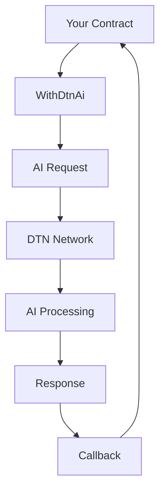

# Smart Contracts Overview

The Deep Trust Network SDK provides a comprehensive set of smart contracts that enable AI functionality in your blockchain applications. This section provides an overview of all available contracts and their purposes.

## Core Contracts

### 1. with-dtn-ai.sol

The main contract that provides AI functionality to your smart contracts.

**Purpose**: Base contract that can be inherited to add AI capabilities to any smart contract.

**Key Features**:
- AI request management
- Session handling
- Response processing
- Security controls

**Usage**:
```solidity
import "@deeptrust/contracts/with-dtn-ai.sol";

contract MyAIContract is WithDtnAi {
    // Your AI-powered contract implementation
}
```

### 2. with-dtn-ai-upgradeable.sol

An upgradeable version of the base AI contract.

**Purpose**: Provides AI functionality for upgradeable contracts using OpenZeppelin's upgradeable pattern.

**Key Features**:
- All features of `with-dtn-ai.sol`
- Upgradeable implementation
- Storage compatibility
- Proxy support

**Usage**:
```solidity
import "@deeptrust/contracts/with-dtn-ai-upgradeable.sol";

contract MyUpgradeableAIContract is WithDtnAiUpgradeable {
    // Your upgradeable AI contract implementation
}
```

### 3. idtn-ai.sol

Interface definitions for AI interactions and data structures.

**Purpose**: Defines the interfaces, structs, and enums used throughout the DTN system.

**Key Components**:
- `IDtnAi` interface
- `DtnRequest` struct
- `CallBack` struct
- `ResponseStatus` enum
- `CallType` enum

**Usage**:
```solidity
import "@deeptrust/contracts/idtn-ai.sol";

// Use the interface for type safety
IDtnAi.DtnRequest memory request = IDtnAi.DtnRequest({
    call: abi.encode(prompt),
    extraParams: "",
    calltype: IDtnAi.CallType.DIRECT,
    feePerByteReq: 0.001 * 10**18,
    feePerByteRes: 0.001 * 10**18,
    totalFeePerRes: 1 * 10**18
});
```

### 4. dtn-defaults.sol

Default configurations and helper functions for common use cases.

**Purpose**: Provides pre-configured routing options and utility functions.

**Key Features**:
- Default routing configurations
- Helper functions for common patterns
- Utility functions for node management

**Usage**:
```solidity
import "@deeptrust/contracts/dtn-defaults.sol";

// Use default system trust
bytes32[] memory routing = DtnDefaults.defaultSystemTrust();

// Use custom nodes
bytes32[] memory routing = DtnDefaults.defaultCustomNodesValidatedAny(nodes);
```

## Contract Architecture

### Inheritance Hierarchy

```
WithDtnAi (Base AI Contract)
├── WithDtnAiUpgradeable (Upgradeable Version)
└── Your Custom Contract

IDtnAi (Interface)
└── Used by all AI contracts

DtnDefaults (Utilities)
└── Used by all contracts for routing
```

### Data Flow



## Contract Dependencies

### External Dependencies

- **OpenZeppelin Contracts**: Security and standard implementations
- **SafeERC20**: Secure token transfer utilities
- **Hardhat Console**: Development debugging (optional)

### Internal Dependencies

- **IDtnAi**: Interface definitions
- **DtnDefaults**: Utility functions
- **WithDtnAi**: Base functionality

## Security Features

### Access Control

All contracts implement proper access control:

- **onlyDtn modifier**: Ensures only DTN contracts can call callbacks
- **Session ownership**: Only session owners can use their sessions
- **Token safety**: Uses SafeERC20 for secure token transfers

### Input Validation

Contracts validate all inputs:

- **Request parameters**: Validates request structure
- **Session IDs**: Ensures valid session ownership
- **Model IDs**: Verifies model existence
- **Fee calculations**: Validates fee structures

### Error Handling

Comprehensive error handling:

- **Graceful failures**: Contracts handle errors without breaking
- **Error propagation**: Errors are properly communicated
- **State consistency**: Contract state remains consistent

## Gas Optimization

### Efficient Patterns

- **Session reuse**: Minimizes session creation costs
- **Batch operations**: Reduces gas for multiple requests
- **Event usage**: Uses events instead of storage when possible
- **Optimized callbacks**: Minimizes gas usage in callbacks

### Cost Considerations

- **Request gas**: Varies by request complexity
- **Callback gas**: Depends on response processing
- **Session gas**: One-time cost for session management
- **Storage gas**: Minimal for state variables

## Upgradeability

### Upgradeable Contracts

The `with-dtn-ai-upgradeable.sol` contract supports:

- **Proxy pattern**: Uses OpenZeppelin's upgradeable proxy
- **Storage compatibility**: Maintains storage layout across upgrades
- **Initialization**: Proper initialization pattern
- **Version management**: Supports multiple versions

### Migration Path

For existing contracts:

1. **Assessment**: Determine if upgradeability is needed
2. **Migration**: Convert to upgradeable pattern if required
3. **Testing**: Thorough testing of upgrade process
4. **Deployment**: Deploy with proper proxy setup

## Best Practices

### Contract Design

1. **Inheritance**: Inherit from appropriate base contract
2. **Interfaces**: Use interfaces for type safety
3. **Events**: Emit events for important state changes
4. **Modifiers**: Use modifiers for access control

### Security

1. **Access Control**: Implement proper access controls
2. **Input Validation**: Validate all external inputs
3. **Error Handling**: Handle errors gracefully
4. **Testing**: Thorough testing of all functions

### Gas Optimization

1. **Session Management**: Reuse sessions when possible
2. **Storage**: Minimize storage operations
3. **Events**: Use events for non-critical data
4. **Batching**: Batch operations when possible

## Common Patterns

### Basic AI Contract

```solidity
contract BasicAIContract is WithDtnAi {
    string public result;
    
    constructor(address ai) {
        setAi(ai);
    }
    
    function askAI(string memory question) public payable {
        // Implementation
    }
    
    function callback(bytes32 requestId) external onlyDtn {
        // Handle response
    }
    
    function onError(bytes32 requestId) external onlyDtn {
        // Handle error
    }
}
```

### Upgradeable AI Contract

```solidity
contract UpgradeableAIContract is WithDtnAiUpgradeable {
    string public result;
    
    function initialize(address ai) public initializer {
        setAi(ai);
    }
    
    function askAI(string memory question) public payable {
        // Implementation
    }
    
    function callback(bytes32 requestId) external onlyDtn {
        // Handle response
    }
    
    function onError(bytes32 requestId) external onlyDtn {
        // Handle error
    }
}
```

## Next Steps

- [with-dtn-ai.sol](with-dtn-ai.md) - Detailed documentation of the base contract
- [with-dtn-ai-upgradeable.sol](with-dtn-ai-upgradeable.md) - Upgradeable contract details
- [idtn-ai.sol](idtn-ai.md) - Interface and data structure documentation
- [dtn-defaults.sol](dtn-defaults.md) - Utility functions and defaults
- [Examples](../examples/basic-ai-call.md) - Practical implementation examples 